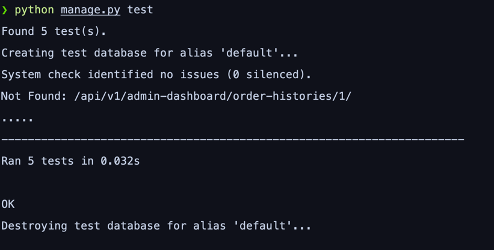
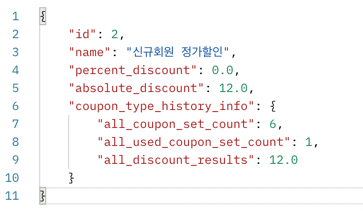
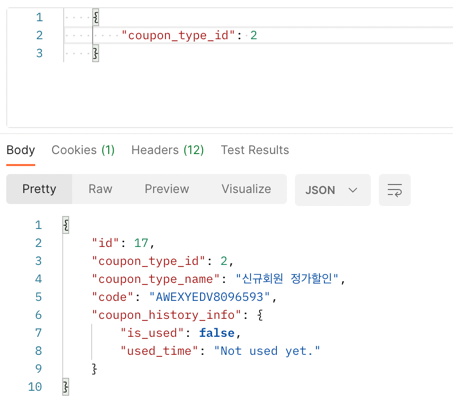
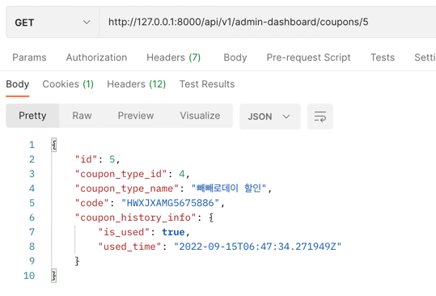

# LABORATORY_SHOP_ADMIN_BACKEND REST API
##
## :bulb: 소개
쇼핑몰 서비스 관리 페이지의 backend API 입니다.

- 제품 주문 내역을 열람할 수 있습니다.
- 주문 건에 대하여, 발송 처리를 할 수 있습니다.
- 쇼핑몰 서비스에는 쿠폰 시스템이 존재합니다.
  - 새로운 쿠폰 타입을 신설할 수 있습니다.
  - 특정 신규 쿠폰 타입에 대한 쿠폰 코드를 발급할 수 있습니다.
  - 발급된 쿠폰의 사용 내역을 열람할 수 있습니다.
  - 쿠폰 타입별 사용횟수, 총 할인액을 조회할 수 있습니다.
- 제품의 배송 상태를 업데이트할 수 있습니다.
  - 상태를 배송중, 배송완료 등으로 수정할 수 있습니다.
- 쿠폰 사용에 따른 할인을 적용할 수 있습니다.
- 구매 국가, 구매 갯수에 다른 배송비를 적용할 수 있습니다.
- 쿠폰 할인, 배송비 적용은 테스트 코드로 검증되었습니다.

## :package: 설치하기

    git clone https://github.com/TGoddessana/laboratory-shop-admin-backend.git
    pip install requirements.txt

    # 개발용이라면,
    pip install requirements/development.txt
    
    # 배포용이라면,
    pip install requirements/production.txt

## :rocket: 어플리케이션 실행하기
    # manage.py 에서 원하는 버전의 settings 환경 변수 설정
    # 개발용이라면, boardflow.settings.development
    # 배포용이라면, boardflow.settings.production
    # 기본값은 아래와 같이 설정되어 있습니다.
    # os.environ.setdefault('DJANGO_SETTINGS_MODULE', 'laboratory_shop_admin_backend.settings.development')
    
    python manage.py runserver

## :fire: 테스트 코드 실행하기

    python manage.py test

## :bug: 테스트 코드에서 검증한 내용
  - 총 다섯 개의 상황을 가정하고, 테스트를 수행하였습니다.

    1. 주문 목록에 대해서 GET 요청을 보냄으로서, 주문 목록을 조회할 수 있습니다.
        1-1. 주문 목록은 5개를 생성할 것이므로, 응답의 길이는 5가 되어야 합니다.
        1-2. 주문 목록의 첫 번째 데이터를 살펴보면, 아래와 같습니다.

                self.orderhistory_1 = OrderHistory(product=self.product_1,
                                           order_place=self.order_place_1,
                                           pay_state=False,
                                           quantity=99,
                                           coupon=self.coupon_1)

                제품은 299000 달러이고,
                주문지역 국가의 국가 코드는 1이며,
                양은 99개,
                쿠폰은 50%를 할인해 주고 있습니다.
                만약 의도한 대로 최종 결제금액 코드가 작동한다면,
                최종 결제가격은 계산에 의해 아래와 같아야 합니다.
                (제품의 가격 * 개수 + 기본 배송비) * 할인쿠폰 적용
                (299000*99 + 10) * (1 - 0.9) = 2960100.9999999995
                1번 주문내역의 total_price 가 위와 같은지 검증합니다.

    2. 주문 상세에 대해서 GET 요청을 보냄으로서, 주문 상세내용을 조회할 수 있습니다.
       2-1. 주문 목록의 세 번째 데이터를 살펴보면, 아래와 같습니다.
            같은 serializer 를 사용하고 있으므로, 계산은 똑같이 들어갔다고 가정합니다.
            직렬화 과정에서, 제품의 id 대신 이름인 "Damas" 가 나타나는지 검증합니다.
            의도되지 않은 응답 키인 "product_id" 가 응답에 나타나지 않는지 검증합니다.

    3. 주문 목록에 대해서 POST 요청을 보내면, 새로운 주문 조회를 생성합니다.
       보내는 데이터에 "어떤 제품을", "어떤 장소에서", "어떤 쿠폰을 사용하여", "몇 개를 주문하는지" 를 입력하면,
       자동으로 "지역에 따른 배송비", "할인가" 를 계산하여 "최종 결제가격" 을 데이터베이스에 저장합니다.
       기존의 5개에 추가된 1개를 더해서, 최종적으로 주문내역은 6개가 되어야 합니다.

    4. 특정 주문에 대해서 PUT 요청을 보냄으로서, 주문에 대해서 수정을 할 수 있습니다.
       "결제 상태", "배송 상태" 등을 바꿀 수 있습니다.
       테스트 코드에서는 1번 주문내역의 "결제 상태" 를 False 에서 True로 바꾸고,
       해당 주문내역 상세에 대한 GET 메서드를 요청하여 pay_state 가 True로 바뀌었는지 확인합니다.

    5. 특정 주문에 대해서 DELETE 요청을 보냄으로서, 주문에 대해서 삭제를 할 수 있습니다.
       1번 주문내역에 DELETE 요청을 보낸 후, 1번 주문내역 상세에 대해서 GET 요청을 보냅니다.
       해당 요청의 상태 코드가 리소스를 찾을 수 없다는 404인지 확인합니다.

- 테스트를 수행한 결과입니다.

## :rocket: REST API 명세
### 총 세 가지의 리소스에 대하여 API를 구현하였습니다.
- **/api/v1/admin-dashboard/order-histories/**
- **/api/v1/admin-dashboard/order-histories/{id}/**
  - 주문내역을 조회, 수정, 삭제 등 관리합니다.
  - 상세 명세는 아래에 게시합니다.
- **/api/v1/admin-dashboard/coupon-types/**
- **/api/v1/admin-dashboard/coupon-types/{id}/**
  - 새로운 쿠폰 타입을 신설할 수 있습니다.
  - 쿠폰 타입은 아래와 같이 세 가지로 나뉩니다.
    - 퍼센트 할인과 정액 할인 두 가지 모두 할인
    - 퍼센트 할인
    - 정액 할인
  - 쿠폰 타입에 대한 조회 시, 해당 쿠폰 타입에 대하여 몇 개의 쿠폰이 발행되었고, 그 중 몇 개가 쓰였고, 총 할인된 금액은 얼마인지를 확인할 수 있습니다.
    - 
- **/api/v1/admin-dashboard/coupons/**
- **/api/v1/admin-dashboard/coupons/{id}/**
  - 특정 쿠폰 타입에 대한 새로운 쿠폰을 발급합니다.
  - 쿠폰 타입을 지정하면 unique한 쿠폰 코드가 발급됩니다.
    - 응답 예시:
    - 
  - 조회 시, 해당 쿠폰이 사용되었는지, 사용되었다면 언제 사용되었는지를 응답합니다.
    - 

### GET /api/v1/admin-dashboard/order-histories/
- 모든 주문내역을 조회합니다.
- 응답 예시:

    [
        {
            "id": 1,
            "created_at": "2022-09-15T01:05:14.945487Z",
            "updated_at": "2022-09-15T01:05:14.945501Z",
            "pay_state": true,
            "quantity": 2,
            "dilivery_price": 15.0,
            "total_price": 6.690000000000006,
            "dilivery_status": "preparing for shipping",
            "product_name": "hyundai damas",
            "coupon": null,
            "order_place": "Vatican City, Seoul, 123412"
        },
        {
            "id": 2,
            "created_at": "2022-09-15T01:06:40.821145Z",
            "updated_at": "2022-09-15T01:11:57.831552Z",
            "pay_state": true,
            "quantity": 1,
            "dilivery_price": 20.0,
            "total_price": 100.07990000000008,
            "dilivery_status": "ready to ship",
            "product_name": "Rolls Royce Phantom Series II",
            "coupon": null,
            "order_place": "Angola, lorem, 21335"
        },
        {
            "id": 3,
            "created_at": "2022-09-15T06:14:33.110889Z",
            "updated_at": "2022-09-15T06:14:33.110938Z",
            "pay_state": true,
            "quantity": 40,
            "dilivery_price": 15.0,
            "total_price": 400014.6,
            "dilivery_status": "preparing for shipping",
            "product_name": "Rolls Royce Phantom Series II",
            "coupon": null,
            "order_place": "Vatican City, Seoul, 123412"
        },
        {
            "id": 4,
            "created_at": "2022-09-15T06:47:34.271949Z",
            "updated_at": "2022-09-15T06:54:16.897912Z",
            "pay_state": true,
            "quantity": 2,
            "dilivery_price": 15.0,
            "total_price": 17803.5422,
            "dilivery_status": "preparing for shipping",
            "product_name": "Rolls Royce Phantom Series II",
            "coupon": 5,
            "order_place": "Vatican City, Seoul, 123412"
        },
        {
            "id": 5,
            "created_at": "2022-09-15T07:10:46.174811Z",
            "updated_at": "2022-09-15T07:10:46.174885Z",
            "pay_state": true,
            "quantity": 444,
            "dilivery_price": 20.0,
            "total_price": 147872.0,
            "dilivery_status": "ready to ship",
            "product_name": "hyundai damas",
            "coupon": null,
            "order_place": "Angola, lorem, 21335"
        },
        {
            "id": 6,
            "created_at": "2022-09-15T07:27:44.298130Z",
            "updated_at": "2022-09-15T07:27:59.316684Z",
            "pay_state": true,
            "quantity": 1,
            "dilivery_price": 20.0,
            "total_price": 10007.99,
            "dilivery_status": "preparing for shipping",
            "product_name": "Rolls Royce Phantom Series II",
            "coupon": null,
            "order_place": "Angola, lorem, 21335"
        },
        {
            "id": 7,
            "created_at": "2022-09-15T13:26:33.422852Z",
            "updated_at": "2022-09-15T13:26:48.018483Z",
            "pay_state": true,
            "quantity": 77,
            "dilivery_price": 15.0,
            "total_price": 770002.23,
            "dilivery_status": "shipping complete",
            "product_name": "Rolls Royce Phantom Series II",
            "coupon": 13,
            "order_place": "Vatican City, Seoul, 123412"
        },
        {
            "id": 8,
            "created_at": "2022-09-15T17:03:06.524611Z",
            "updated_at": "2022-09-15T17:03:06.524675Z",
            "pay_state": true,
            "quantity": 1,
            "dilivery_price": 15.0,
            "total_price": 10014.99,
            "dilivery_status": "preparing for shipping",
            "product_name": "Rolls Royce Phantom Series II",
            "coupon": null,
            "order_place": "Vatican City, Seoul, 123412"
        },
        {
            "id": 9,
            "created_at": "2022-09-15T17:03:13.109615Z",
            "updated_at": "2022-09-15T17:03:13.109710Z",
            "pay_state": true,
            "quantity": 1,
            "dilivery_price": 15.0,
            "total_price": 10014.99,
            "dilivery_status": "preparing for shipping",
            "product_name": "Rolls Royce Phantom Series II",
            "coupon": null,
            "order_place": "Vatican City, Seoul, 123412"
        },
        {
            "id": 10,
            "created_at": "2022-09-15T17:05:16.780218Z",
            "updated_at": "2022-09-15T17:05:16.780323Z",
            "pay_state": true,
            "quantity": 11,
            "dilivery_price": 15.0,
            "total_price": 14546.0,
            "dilivery_status": "preparing for shipping",
            "product_name": "kia morning",
            "coupon": null,
            "order_place": "Vatican City, Seoul, 123412"
        }
    ]

### POST /api/v1/admin-dashboard/order-histories/
- 새로운 주문내역을 생성합니다.
- 요청 예시: 해당 데이터들을 body에 담아 보냅니다.

    {
        "pay_state": true,
        "quantity": 2,
        "dilivery_price": 15.0,
        "dilivery_status": "preparing for shipping",
        "product_id": 2,
        "coupon": null,
        "order_place_id": 1
    }

- 응답 예시: 아래와 같이 생성된 주문내역의 정보를 응답합니다.

    {
        "id": 11,
        "created_at": "2022-09-15T18:17:24.993197Z",
        "updated_at": "2022-09-15T18:17:24.993239Z",
        "pay_state": true,
        "quantity": 2,
        "dilivery_price": 15.0,
        "total_price": 681.0,
        "dilivery_status": "preparing for shipping",
        "product_name": "hyundai damas",
        "coupon": null,
        "order_place": "Vatican City, Seoul, 123412"
    }

### GET /api/v1/admin-dashboard/order-histories/{id}/
- 주문 내역의 상세정보를 조회합니다.
- 응답 예시:

    {
        "id": 11,
        "created_at": "2022-09-15T18:17:24.993197Z",
        "updated_at": "2022-09-15T18:21:29.503441Z",
        "pay_state": false,
        "quantity": 2,
        "dilivery_price": 15.0,
        "total_price": 681.0,
        "dilivery_status": "preparing for shipping",
        "product_name": "hyundai damas",
        "coupon": null,
        "order_place": "Vatican City, Seoul, 123412"
    }

### PUT /api/v1/admin-dashboard/order-histories/{id}/
- 주문내역이 존재한다면 수정하고, 존재하지 않는다면 생성합니다.
- 요청 예시: 해당 데이터들을 body에 담아 보냅니다.

    {
        "pay_state": false,
        "quantity": 2,
        "dilivery_price": 15.0,
        "dilivery_status": "preparing for shipping",
        "product_id": 2,
        "coupon": null,
        "order_place_id": 1
    }

- 응답 예시 : 아래와 같이 수정된 주문내역의 정보를 응답합니다.

    {
        "id": 11,
        "created_at": "2022-09-15T18:17:24.993197Z",
        "updated_at": "2022-09-15T18:21:29.503441Z",
        "pay_state": false,
        "quantity": 2,
        "dilivery_price": 15.0,
        "total_price": 681.0,
        "dilivery_status": "preparing for shipping",
        "product_name": "hyundai damas",
        "coupon": null,
        "order_place": "Vatican City, Seoul, 123412"
    }

### DELETE /api/v1/admin-dashboard/order-histories/{id}/
- id로 특정되는 주문내역을 삭제합니다.
- 별도의 응답 내용은 없으며, 삭제 성공 시 204 상태 코드를 응답합니다.

